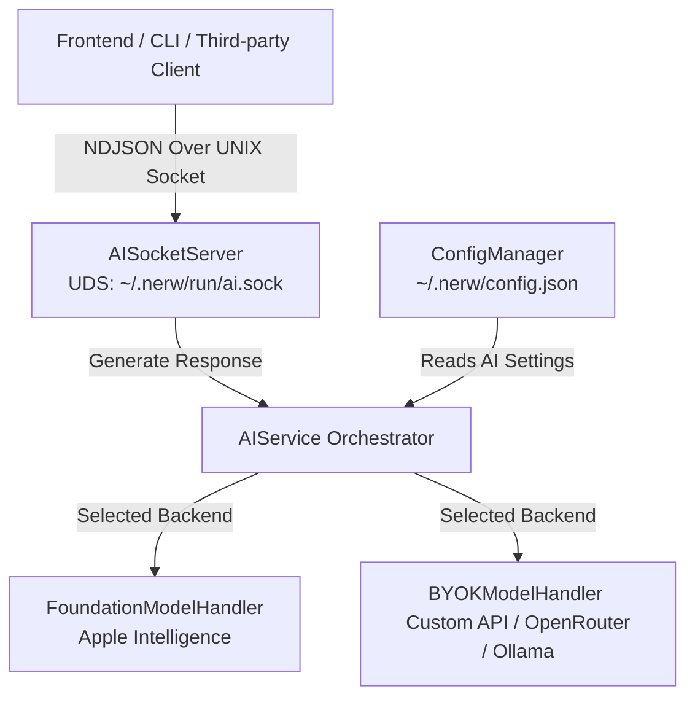

# Nerw AI Integration: Backend Infrastructure & Protocol Specification

This document details the architecture, configuration, protocol specification, and testing instructions for the new AI integration subsystem in Nerw.

---

## 1. Architectural Overview

The AI subsystem provides a unified interface for language model generation, supporting both on-device foundation models (Apple Intelligence) and custom cloud/local API providers (BYOK - Bring Your Own Key).

### Components



- **`AISocketServer`**: A background UNIX Domain Socket (UDS) server that listens for client connections, processes incoming queries, and streams responses back using a newline-delimited JSON (NDJSON) protocol.
- **`AIService`**: The central coordinator that resolves the current model preferences and routes prompt payloads to the active model handler.
- **`FoundationModelHandler`**: Manages interaction with Apple’s native on-device language models (`import FoundationModels`) on macOS 15.0+ Apple Silicon. Contains a premium simulated runtime for older versions of macOS or Intel hardware to maintain full development flow.
- **`BYOKModelHandler`**: Formats and executes standard HTTPS completions requests targeting OpenAI-compatible endpoints (supporting custom base URLs, auth keys, custom models, system prompts, temperature controls, and vision/image uploads).
- **`AISettingsViewController`**: The native settings panel under **Settings > AI** that lets users enable the subsystem, toggle backends, input API keys, adjust parameters, and check hardware compatibility.

---

## 2. Configuration Options

Settings are stored in the root `~/.nerw/config.json` inside the `aiConfig` block:

| Parameter | Type | Default Value | Description |
|---|---|---|---|
| `isEnabled` | `Bool` | `false` | Enables/Disables the AI subsystem and UDS socket server. |
| `selectedModelType` | `String` | `"byok"` | Active model backend. Choose `"foundation"` or `"byok"`. |
| `byokApiUrl` | `String` | `"https://api.openai.com/v1/chat/completions"` | Base URL of the completions API. |
| `byokApiKey` | `String` | `""` | Bearer authorization token/key. |
| `byokModelName` | `String` | `"gpt-4o"` | The specific model identifier (e.g., `google/gemini-2.5-flash` for OpenRouter). |
| `supportsImages` | `Bool` | `true` | Declares if the BYOK model supports multimodal image/vision inputs. |
| `systemPrompt` | `String` | `"You are a helpful macOS assistant."` | Base instructions injected before the conversation starts. |
| `temperature` | `Double` | `0.7` | Creativity control (0.0 for deterministic, 1.0 for creative). |
| `maxTokens` | `Int` | `1024` | Maximum tokens generated per completion request (0 for no limit). |

---

## 3. IPC Socket & NDJSON Protocol

A client (such as a frontend window or terminal script) connects to the Unix socket at:
`~/.nerw/run/ai.sock`

The socket communicates using a line-delimited NDJSON protocol. Every packet sent or received is a single-line JSON structure followed by a `\n` character.

### Message Envelope Structure

```json
{
  "id": "optional-correlation-uuid",
  "type": "message_type",
  "payload": "base64-encoded-json-payload"
}
```

*   **`id`**: A unique request ID generated by the client. The server includes the matching `id` in all response chunks to coordinate multiple requests.
*   **`type`**: Indicates the message purpose (e.g., `chat_request`, `chunk`, `done`, `error`).
*   **`payload`**: The actual request/response payload, serialized as a JSON string and encoded in standard Base64 to ensure clean transport inside the envelope.

---

### Request Payload (`chat_request`)

Sent by the client to request prompt completion.

*   Envelope `type`: `"chat_request"`
*   Decoded `payload` JSON Schema:

```json
{
  "prompt": "Explain quantum computing in simple terms.",
  "history": [
    { "role": "user", "content": "What is 2+2?" },
    { "role": "assistant", "content": "It is 4." }
  ],
  "images": [
    "iVBORw0KGgoAAAANSUhEUgAAAAEAAAABCAQAAAC1HAwCAAAAC0lEQVR42mNkYAAAAAYAAjCB0C8AAAAASUVORK5CYII="
  ],
  "isStreaming": true
}
```

*   **`prompt`**: The main user text query.
*   **`history`**: (Optional) An array of previous message turns (`role` and `content`) to preserve conversation context.
*   **`images`**: An array of Base64-encoded image data strings (JPEG or PNG). Empty array if text-only.
*   **`isStreaming`**: If `true`, response chunks are streamed in real-time. If `false`, the server returns a single response block.

---

### Response Payloads

#### 1. Streaming Chunk (`chunk`)
Emitted by the server for each newly generated token delta.

*   Envelope `type`: `"chunk"`
*   Decoded `payload` JSON Schema:

```json
{
  "text": "Quantum ",
  "error": null,
  "isDone": false
}
```

#### 2. Completion Done (`done`)
Emitted by the server to signal the successful end of the stream.

*   Envelope `type`: `"done"`
*   Decoded `payload` JSON Schema:

```json
{
  "text": "",
  "error": null,
  "isDone": true
}
```

#### 3. Error Event (`error`)
Emitted if an API request fails, key is invalid, or connection drops.

*   Envelope `type`: `"error"`
*   Decoded `payload` JSON Schema:

```json
{
  "text": "",
  "error": "API Error: HTTP error status 401: Invalid API Key.",
  "isDone": true
}
```

---

## 4. Testing & BYOK Verification

### A. Free Model Test via OpenRouter
If you want to test the BYOK model configuration using **OpenRouter** and a free model (e.g., Gemini 2.5 Flash Free):

1.  Open the settings panel in Nerw (**Cmd + ,** or Click Status bar -> Settings) and navigate to the **AI** tab.
2.  Check **Enable AI Assistant Subsystem**.
3.  Set **Model Backend** to **BYOK (Bring Your Own Key / Custom API)**.
4.  Input the following values:
    *   **API Endpoint URL**: `https://openrouter.ai/api/v1/chat/completions`
    *   **API Key**: *Your OpenRouter API Key*
    *   **Model Name**: `google/gemini-2.5-flash:free`
    *   **Vision Support**: *Checked* (Gemini supports vision)
5.  Press enter on any text field to save changes.

### B. Local Test via Ollama
If you want to test locally with zero costs:
1.  Ensure Ollama is running (`ollama run llama3.1` or another installed model).
2.  Set:
    *   **API Endpoint URL**: `http://localhost:11434/v1/chat/completions`
    *   **API Key**: *Leave empty*
    *   **Model Name**: `llama3.1`
    *   **Vision Support**: *Unchecked* (unless using a vision model like `llava`)

---

## 5. Verification Script

To test the socket connection end-to-end, compile and execute the test client script provided in `Scripts/test_ai_socket.swift`. It connects to the active socket, sends a text request, and prints the token deltas as they are received.

---

## 6. Front-end Implementation & UI Layout System

Nerw provides a custom, premium card-based Conversation UI inside the app that replaces the main search panel when the `"AI Chat"` action is triggered.

### UI Hierarchy & Component Architecture

The visual layout is implemented programmatically using Auto Layout inside [ConversationViewController](file:///Users/suvasanketrout/Developer/Nerw/Sources/NerwUI/Conversation/ConversationViewController.swift):

```
+--------------------------------------------------------+
|  AI Assistant                                          |
+--------------------------------------------------------+
|                                          [User Query]  |
|        +--------------------------------+          [|] |
|        |                                |              |
|        |       Scrollable Response      |          [|] |
|        |            Text Area           |              |
|        |                                |          [|] |
|        +--------------------------------+              |
|                                                    [ ] |
|        +--------------------------------------------+  |
|        | Ask AI...                       [Ripple]   |  |
|        +--------------------------------------------+  |
+--------------------------------------------------------+
```

1. **Host Panel Window Controller** ([ConversationWindowController](file:///Users/suvasanketrout/Developer/Nerw/Sources/NerwUI/Conversation/ConversationWindowController.swift)):
   - Manages the lifecycle of a borderless `ConversationPanel` window.
   - Sizes the window to match the exact dimensions of the search panel (`GlobalLayout.mainWidth` by `GlobalLayout.mainHeight`).
   - Positions it overlapping the search panel's location using `NerwPanelContext.shared.exactOrigin`.

2. **Frosted Glass Backdrop**:
   - Built using `NerwPanelView(style: .main)` as the root view.
   - Automatically supports dynamic liquid glass aesthetics (utilizing `NSGlassEffectView` with `.vibrantDark` on macOS 26.0+) and classic frosted glass blending (`NSVisualEffectView` behind window).

3. **Right Indicator Timeline** (`SegmentBarView`):
   - A vertical stack of thin, rounded segment bars representing the query history turns, positioned between the right edge of the card and the right window edge.
   - It is vertically centered relative to the entire panel height.
   - The active turn's indicator lights up using the theme's accent selection color, while inactive turns are dimmed.
   - Clicking a segment switches the active card view content to that turn.

4. **Translucent Response Card**:
   - The main response display area is wrapped in a rounded card view (`layer.cornerRadius = 16`).
   - Styled dynamically using the active theme's selection color (`selectionBackgroundColorHex`) made translucent (`0.18` opacity) with matching border accents (`0.35` opacity).
   - Horizontal scrolling is completely disabled; text is strictly wrapped and bounds to the container size, while allowing vertical scrolling.

5. **User Query Text**:
   - The user query container rests just above the prompt input, beginning from the horizontal middle of the panel.
   - A translucent, bold text label that displays the current query context.
   - If the query exceeds the container length, an arrow button appears which expands to show the full query upon clicking.

6. **Scrollable Response Area** (`NSTextView`):
   - A read-only, selectable text area wrapped inside `NSScrollView`.
   - Initialized with a default non-zero frame size `(100x100)` to ensure proper wrapping and layout computations.
   - Uses the theme's foreground color (`foregroundColorHex` or `.labelColor` fallback) for high-contrast visibility.

7. **Floating Prompt Input** (`PromptTextField` & Context Menu):
   - A rounded glass container at the bottom holding a custom `NSTextField`.
   - Features a 3-dots context menu button on the right edge. Clicking this button overlays an `ActionContextPanel` identical to the main UI, centered relative to the button.
   - The context panel provides options like "Clear Chat" (`⌥⌘⌫`) and History Navigation ("Previous Message" / "Next Message" utilizing navigation style bindings, e.g., `⌃P`/`⌃N` or `⌃K`/`⌃J`).
   - Pressing `Enter` triggers submission (`onSubmit`), `Esc` dismisses the panel, and `Cmd+K` toggles the context menu.

8. **Stream Parsing & Generation UI Hooks**:
   - The raw stream from `AIService` is piped through the `AIStreamParser`.
   - Instead of raw strings reaching the text view, the parser extracts hidden `<think>` and `<action>` tags.
   - Triggers UI state changes such as replacing the prompt input area's state with a pulsing `RippleAnimationView` and displaying `"Generating..."` text dynamically.

9. **Disabled Subsystem Warnings**:
   - If the AI assistant is disabled in settings, the prompt and scroll fields are hidden.
   - Renders a warning panel displaying a glassmorphic **"Configure AI..."** button. Clicking this dismisses the chat view and deep-links to **Settings > AI** via notification observers.

---

## 7. Middle-End Parser & Action Hooks

To grant the AI autonomy (e.g., setting timers, interacting with macOS natively) without exposing ugly JSON syntax to the user, the app uses a stateful streaming interceptor called `AIStreamParser`.

### System Prompt Injection
The `BYOKModelHandler` injects a hidden schema into the base system prompt:
```xml
You can perform actions by outputting special XML tags.
To show that you are thinking, wrap your thoughts in <think>...</think>.
To perform an action, output an <action>JSON_PAYLOAD</action>.
Supported actions:
- timer: { "type": "timer", "duration": 60, "label": "Boil eggs" }
- reminder: { "type": "reminder", "title": "Buy milk" }
- calendar: { "type": "calendar", "title": "Meeting", "date": "2026-06-22T10:00:00Z" }
- memory: { "type": "memory", "action": "save", "content": "User likes blue" }
Do not output action tags for things you cannot do.
```

### Stream Parser Mechanics
The `AIStreamParser` consumes token chunks as they arrive from the backend and maintains an internal buffer:
- **Thinking Hook**: Detects `<think>...</think>` bounds. It invokes `onThinkingStateChanged(true)` when entering a block and `(false)` when exiting. The text inside the block is swallowed and never reaches the user interface.
- **Action Hook**: Detects `<action>...</action>` tags containing JSON payloads. It buffers the JSON text internally, parses it upon the closing tag, and fires `onActionDetected(type, payload)`.
- **Native Execution**: Detected actions are routed to `AIActionManager.swift`, which natively integrates with macOS APIs. Currently supported capabilities include setting system notifications for **timers** (via `UNUserNotificationCenter`), creating Apple **Reminders**, and scheduling **Calendar** events (via `EventKit`).
- **Text Safety**: When a partial tag (like `<thi`) is buffering, it gracefully halts text output until the tag either completes or resolves to raw text, preventing UI flickering.
