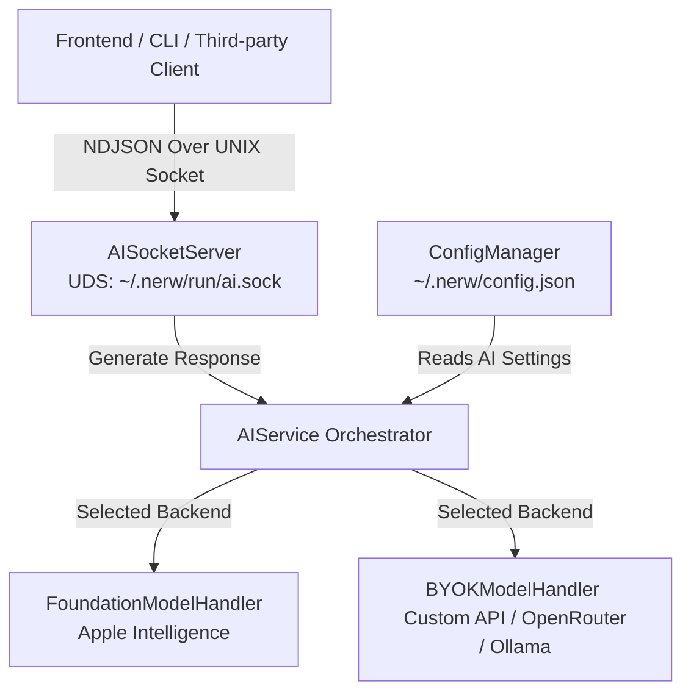

# Nerw AI Integration: Backend Infrastructure & Protocol Specification

This document details the architecture, configuration, protocol specification, and testing instructions for the new AI integration subsystem in Nerw.

---

## 1. Architectural Overview

The AI subsystem provides a unified interface for language model generation, supporting both on-device foundation models (Apple Intelligence) and custom cloud/local API providers (BYOK - Bring Your Own Key).

### Components



- **`AISocketServer`**: A background UNIX Domain Socket (UDS) server that listens for client connections, processes incoming queries, and streams responses back using a newline-delimited JSON (NDJSON) protocol.
- **`AIService`**: The central coordinator that resolves the current model preferences and routes prompt payloads to the active model handler.
- **`FoundationModelHandler`**: Manages interaction with Apple’s native on-device language models (`import FoundationModels`) on macOS 15.0+ Apple Silicon. Contains a premium simulated runtime for older versions of macOS or Intel hardware to maintain full development flow.
- **`BYOKModelHandler`**: Formats and executes standard HTTPS completions requests targeting OpenAI-compatible endpoints (supporting custom base URLs, auth keys, custom models, system prompts, temperature controls, and vision/image uploads).
- **`AISettingsViewController`**: The native settings panel under **Settings > AI** that lets users enable the subsystem, toggle backends, input API keys, adjust parameters, and check hardware compatibility.

---

## 2. Configuration Options

Settings are stored in the root `~/.nerw/config.json` inside the `aiConfig` block:

| Parameter | Type | Default Value | Description |
|---|---|---|---|
| `isEnabled` | `Bool` | `false` | Enables/Disables the AI subsystem and UDS socket server. |
| `selectedModelType` | `String` | `"byok"` | Active model backend. Choose `"foundation"` or `"byok"`. |
| `byokApiUrl` | `String` | `"https://api.openai.com/v1/chat/completions"` | Base URL of the completions API. |
| `byokApiKey` | `String` | `""` | Bearer authorization token/key. |
| `byokModelName` | `String` | `"gpt-4o"` | The specific model identifier (e.g., `google/gemini-2.5-flash` for OpenRouter). |
| `supportsImages` | `Bool` | `true` | Declares if the BYOK model supports multimodal image/vision inputs. |
| `systemPrompt` | `String` | `"You are a helpful macOS assistant."` | Base instructions injected before the conversation starts. |
| `temperature` | `Double` | `0.7` | Creativity control (0.0 for deterministic, 1.0 for creative). |
| `maxTokens` | `Int` | `1024` | Maximum tokens generated per completion request (0 for no limit). |

---

## 3. IPC Socket & NDJSON Protocol

A client (such as a future frontend window or terminal script) connects to the Unix socket at:
`~/.nerw/run/ai.sock`

The socket communicates using a line-delimited NDJSON protocol. Every packet sent or received is a single-line JSON structure followed by a `\n` character.

### Message Envelope Structure

```json
{
  "id": "optional-correlation-uuid",
  "type": "message_type",
  "payload": "base64-encoded-json-payload"
}
```

*   **`id`**: A unique request ID generated by the client. The server includes the matching `id` in all response chunks to coordinate multiple requests.
*   **`type`**: Indicates the message purpose (e.g., `chat_request`, `chunk`, `done`, `error`).
*   **`payload`**: The actual request/response payload, serialized as a JSON string and encoded in standard Base64 to ensure clean transport inside the envelope.

---

### Request Payload (`chat_request`)

Sent by the client to request prompt completion.

*   Envelope `type`: `"chat_request"`
*   Decoded `payload` JSON Schema:

```json
{
  "prompt": "Explain quantum computing in simple terms.",
  "images": [
    "iVBORw0KGgoAAAANSUhEUgAAAAEAAAABCAQAAAC1HAwCAAAAC0lEQVR42mNkYAAAAAYAAjCB0C8AAAAASUVORK5CYII="
  ],
  "isStreaming": true
}
```

*   **`prompt`**: The main user text query.
*   **`images`**: An array of Base64-encoded image data strings (JPEG or PNG). Empty array if text-only.
*   **`isStreaming`**: If `true`, response chunks are streamed in real-time. If `false`, the server returns a single response block.

---

### Response Payloads

#### 1. Streaming Chunk (`chunk`)
Emitted by the server for each newly generated token delta.

*   Envelope `type`: `"chunk"`
*   Decoded `payload` JSON Schema:

```json
{
  "text": "Quantum ",
  "error": null,
  "isDone": false
}
```

#### 2. Completion Done (`done`)
Emitted by the server to signal the successful end of the stream.

*   Envelope `type`: `"done"`
*   Decoded `payload` JSON Schema:

```json
{
  "text": "",
  "error": null,
  "isDone": true
}
```

#### 3. Error Event (`error`)
Emitted if an API request fails, key is invalid, or connection drops.

*   Envelope `type`: `"error"`
*   Decoded `payload` JSON Schema:

```json
{
  "text": "",
  "error": "API Error: HTTP error status 401: Invalid API Key.",
  "isDone": true
}
```

---

## 4. Testing & BYOK Verification

### A. Free Model Test via OpenRouter
If you want to test the BYOK model configuration using **OpenRouter** and a free model (e.g., Gemini 2.5 Flash Free):

1.  Open the settings panel in Nerw (**Cmd + ,** or Click Status bar -> Settings) and navigate to the **AI** tab.
2.  Check **Enable AI Assistant Subsystem**.
3.  Set **Model Backend** to **BYOK (Bring Your Own Key / Custom API)**.
4.  Input the following values:
    *   **API Endpoint URL**: `https://openrouter.ai/api/v1/chat/completions`
    *   **API Key**: *Your OpenRouter API Key*
    *   **Model Name**: `google/gemini-2.5-flash:free`
    *   **Vision Support**: *Checked* (Gemini supports vision)
5.  Press enter on any text field to save changes.

### B. Local Test via Ollama
If you want to test locally with zero costs:
1.  Ensure Ollama is running (`ollama run llama3.1` or another installed model).
2.  Set:
    *   **API Endpoint URL**: `http://localhost:11434/v1/chat/completions`
    *   **API Key**: *Leave empty*
    *   **Model Name**: `llama3.1`
    *   **Vision Support**: *Unchecked* (unless using a vision model like `llava`)

---

## 5. Verification Script

To test the socket connection end-to-end, compile and execute the test client script provided in `Scripts/test_ai_socket.swift`. It connects to the active socket, sends a text request, and prints the token deltas as they are received.
